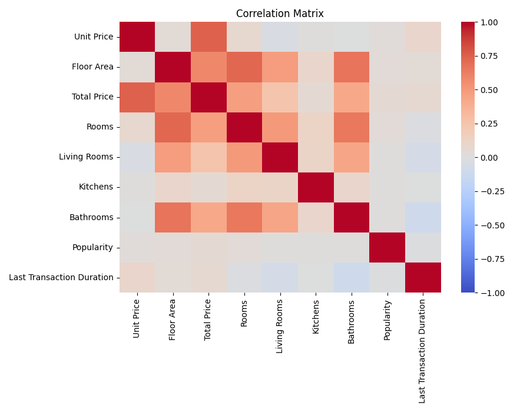
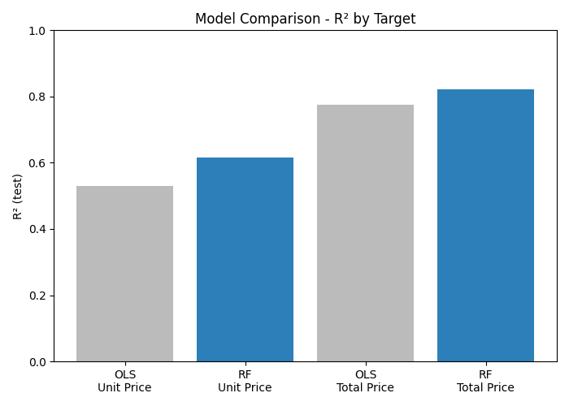
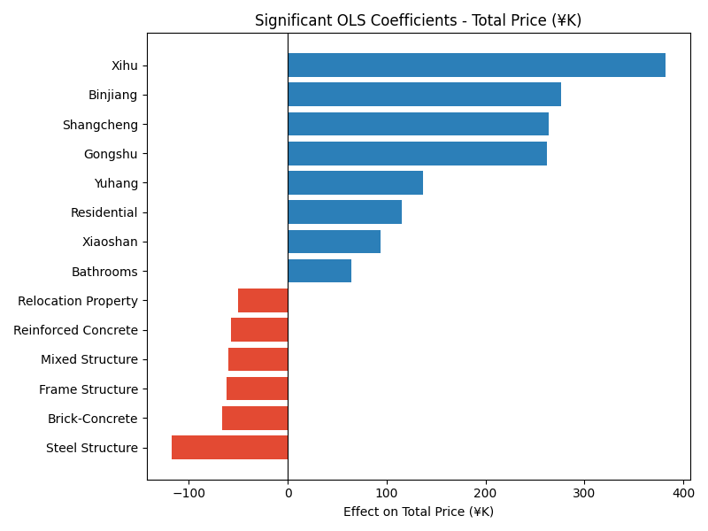
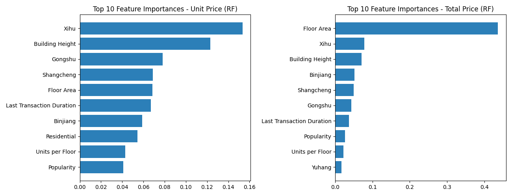

# Hangzhou Second-Hand Housing Pricing Model
### JLL Market Insights — Data-Driven Pricing Analysis

In March 2024, Hangzhou eased restrictions on second-hand home purchases, and monthly transaction volumes rose
to nearly 8,000 units, about 15% higher than the prior year. This analysis builds a pricing model, an
interpretable OLS regression alongside a Random Forest, to help JLL's Hangzhou Market Insights team understand
what actually drives housing prices across 27,554 listings sourced from Lianjia, and translates the results
into pricing and marketing guidance.

## Methodology

**1. Data loading and descriptive statistics.** 27,554 second-hand listings across Hangzhou's districts, no
missing values in the numeric features. Unit price averages ¥36,540/m² (median ¥31,749); total price averages
¥383K (median ¥300K). Both right-skewed, with a small share of large, high-value listings pulling the mean
above the median.

**2. Exploratory data analysis.** Total price correlates strongly with floor area and moderately with rooms and
bathrooms, as expected. Unit price correlates with total price but far less with size, consistent with it being
a size-normalized measure. Total price scales roughly linearly with floor area for most listings, with a handful
of large outliers. Popularity (listing views) shows no strong relationship with unit price. Xihu (West Lake)
stands out with the highest mean total price by a wide margin, and total price rises fairly consistently with
bathroom and bedroom count.

**3. Data preparation.** The dataset arrives pre-encoded into one-hot groups covering floor level, unit layout,
property type, structure type, building material, renovation, district, acquisition type, ownership share,
years held, and elevator status. Each group is mutually exclusive and sums to exactly 1 per row, so one
interpretable reference category is dropped from each before modeling, which is the standard approach for including categorical groups alongside an intercept. `Unit Price` and `Total Price` are kept out of each other's predictor sets throughout, since `Unit Price` is arithmetically derived from `Total Price ÷ Floor Area`.

**4. Multicollinearity check (VIF).** Most predictors sit comfortably below VIF 10. Renovation and
structure-material dummies run higher (up to about 200). This is a real, explainable pattern, since certain building materials and renovation levels tend to co-occur in this market, not a specification issue. District, room count, bathroom count, and elevator status are the variables driving the business conclusions below, all of which have low VIFs.

**5. Modeling.** Two models per target (Unit Price, Total Price): OLS for transparent, coefficient-level
interpretation, and Random Forest for predictive accuracy and non-linear/interaction effects.

**6. Driver analysis and business translation.** Significant OLS coefficients and Random Forest feature
importance compared to identify which factors are both statistically reliable and practically meaningful,
translated into pricing and marketing recommendations.

## Results

| Model | Target | R² (test) | MAE |
|---|---|---|---|
| OLS | Unit Price (¥/m²) | 0.530 | ¥8,815/m² |
| Random Forest | Unit Price (¥/m²) | 0.774 | ¥5,246/m² |
| OLS | Total Price (¥K) | 0.616 | ¥114K |
| Random Forest | Total Price (¥K) | 0.822 | ¥62K |

The Random Forest explains about 77% of the variance in unit price and 82% in total price, a meaningful lift
over OLS, reflecting real non-linear and interaction effects the linear model can't capture.

## What actually drives price

District is the dominant, most consistent driver of price in both models. Being in Xihu (West Lake) adds
roughly ¥382K to total price and ¥34,900/m² to unit price relative to the smallest district (Fuyang), holding
other features constant. This is by far the largest effect in the model. Binjiang, Shangcheng, and Gongshu follow with similarly large premiums.

Building height and floor area matter substantially in the Random Forest, reflecting real non-linear effects the
linear model captures only partially. Floor area has a positive effect on total price (+¥2.7K per m²) but a
negative effect on unit price (-¥25.8 per m²). They're both consistent with how real estate normally prices: larger homes cost more in total but slightly less per square metre.

Bathrooms, bedrooms, and elevator access are all significant, practical value-adds, each additional bathroom
adds about ¥64.6K, each bedroom about ¥19.8K, and having an elevator adds about ¥25.0K to total price.

Renovation level shows no statistically significant effect on either unit or total price once the full feature
set is controlled for (p>0.15 in all cases). Property type, structure, and location dominate the price story
far more than renovation finish in this dataset.

## Business recommendations for JLL

**District-tiered pricing.** District accounts for the largest, most consistent price gaps in both models. A
tiered pricing framework anchored on distance-from-Xihu-equivalent discounts (Xihu the ceiling, Fuyang and Linan
the floor) would give agents a defensible, data-backed starting point for listings rather than relying on
comparables alone.

**Lead with bathrooms, bedrooms, and elevator access in listings.** These are the property-level features with
the largest, most reliable positive effects on price and are directly actionable in how listings are marketed
and staged.

**Use OLS for client-facing pricing conversations, Random Forest for internal accuracy.** OLS gives agents a
coefficient they can explain to a client ("this district costs you ¥X relative to the baseline"), while the
Random Forest (R² of 0.77-0.82) can serve as JLL's internal estimator for day-to-day valuation.

**Don't lead marketing on renovation level.** Contrary to intuition, renovation grade isn't a statistically
significant price driver once location and property characteristics are accounted for. Marketing spend is
better directed at district positioning and core property features than renovation narratives.

## Key takeaway

District, floor area, bathroom/bedroom count, and elevator access are the reliable, well-identified drivers of
Hangzhou housing prices in this dataset. Together they explain the majority of the Random Forest's predictive
power (R²=0.77-0.82) and give JLL's Market Insights team a defensible basis for pricing guidance. Renovation
level and market popularity, by contrast, show weak or no significant standalone effect once the fuller feature
set is controlled for, and shouldn't be over-weighted in pricing or marketing strategy.

## Files

- `Hangzhou_Housing_Pricing_Model.ipynb` — full analysis, runnable end to end
- `Hangzhou_Housing_Pricing_Model.html` — rendered version, no need to run anything to view it
- `data_for_predict.csv` — the underlying dataset
- `chart_*.png` — exported figures
- `vif_check.csv`, `ols_unit_summary.txt`, `ols_total_summary.txt`, `feature_importance_*.csv`, `model_performance.csv` — supporting output
